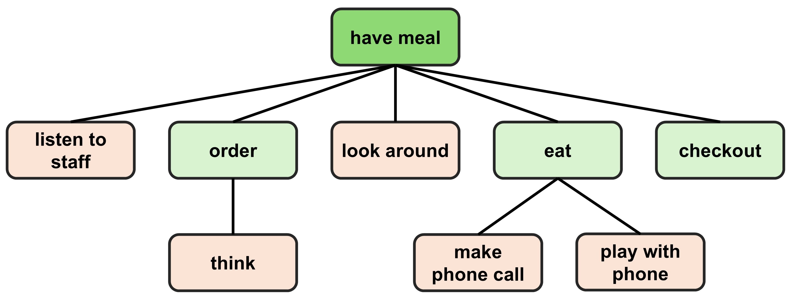

# Action

## Definition
An *action* is defined as a behavior or activity that a character can perform within the environment. By executing a specific action, a character can carry out a series of semantically meaningful behaviors. The continuous execution of multiple actions allows a character to engage in sustained, long-term activity within the environment.

## Action Hierarchy
When considering a character's action within an environment, there are various levels of granularity to account for. For instance, a character could be "shopping in a clothing store," "asking the store clerk for advice," "speaking while asking for advice," or even "slightly raising an arm while gesturing" during the process. However, breaking actions down to an infinite level of detail is impractical. Therefore, we have designed a hierarchical framework that defines actions in three tiers: *high-level action*, *mid-level action*, and *low-level action*.

### High-level Action
A high-level action is defined as a broad decision made by a character within the environment. It can be understood as simply "what should I do next in this shopping mall?" This type of action encompasses a character's decision-making process, such as "have a meal at a restaurant," "browse a store," "get a haircut at the barber shop," or navigational behaviors like "go to the gym." High-level actions can also involve temporary decisions, such as "wait outside the restaurant" when it is crowded.

In summary, a high-level action represents a character’s overarching decision or goal. It typically corresponds to a complete event and is usually purposeful, with a clear objective.

### Mid-level Action
A mid-level action is a more specific task that breaks down a high-level action into smaller components. Each high-level action corresponds to two types of mid-level actions: *fixed mid-level actions* and *optional mid-level actions*.

  - **Fixed Mid-level Actions**: These are mandatory sub-actions that must be performed when executing a high-level action. For example, the high-level action "have meal" corresponds to the fixed mid-level actions of "order," "eat," and "checkout." Every high-level action is always associated with one or more fixed mid-level actions.

  - **Optional Mid-level Actions**: These represent actions that can be inserted randomly into the sequence of fixed mid-level actions, such as "talk with the staff" or "make a phone call." Optional mid-level actions introduce variety and unpredictability into the execution of high-level actions. A high-level action may involve zero or multiple optional mid-level actions.

During the execution of a high-level action, it is typically broken down into several mid-level actions. While most mid-level actions are performed in sequence, some can occur simultaneously, such as "walking" while "making a phone call."

### Low-level Action
A low-level action represents the specific implementation of each mid-level action within the 3D simulation. It includes the character's physical movements, individual actions, interactive behaviors, cross-actions, and functional tasks. The implementation of a low-level action is closely tied to the corresponding mid-level and high-level actions. For more details, please refer to the [Simulator](https://llmcrowd.readthedocs.io/en/latest/developing/simulator/index.html) part.

In general, high-level actions provide an overview of the behavior and its broad parameters, while mid-level actions further refine the behavior and its specific parameters. Low-level actions, in contrast, are directly linked to the simulator's execution.

## Action Pool
In this system, we have pre-defined a series of plausible action templates, which are organized into an *Action Pool*. This pool represents the set of behaviors available for a character to choose from within the shopping mall environment. 

Both high-level actions and mid-level actions are included in the action pool, each pre-defined with detailed information such as name, description, category, parameters, parameter explanations, and more. Additionally, the action pool also includes the potential structure of these actions.

### Content
The action pool contains a total of 12 high-level actions and 22 mid-level actions.

High-level Action Template:
```json
{
    "action id": "<str>",
    "action name": "<str>",
    "action category": "<str>",
    "action description": "<str>",
    "fixed mid-level actions": ["<str>"],
    "optional mid-level actions": ["<str>"],
    "definition of param i": "<str>"
}
```
In the high-level action template, the following fields are pre-defined:
- `action id`: The index of the action.
- `action name`: The name of the action.
- `action category`: `["in_state", "out_state", "transition"]`. Specifies whether the action occurs within a state, outside a state, or during a state transition.
- `action description`: A natural language description of the action.
- `fixed mid-level actions`: A sequence of fixed mid-level actions corresponding to the high-level action.
- `optional mid-level actions`: A list of optional mid-level actions supported by the high-level action.
- `definition of param`: Describes the parameters required for the execution of the action, in natural language.

Mid-level Action Template:
```json
{
    "action id": "<str>",
    "action name": "<str>",
    "action category": "<str>",
    "action description": "<str>",
    "definition of param i": "<str>"
}
```
In the mid-level action template, the following fields are pre-defined:
- `action id`: The index of the action.
- `action name`: The name of the action.
- `action category`: `["fixed", "optional", "fixed or optional"]`. Specifies whether the mid-level action is fixed, optional, or can be either.
- `action description`: A natural language description of the action.
- `definition of param`: Describes the parameters required for the execution of the action, in natural language.

There may be overlap between the parameters of high-level and low-level actions. In such cases, the high-level parameters are more generalized, while the low-level parameters are more specific. If the low-level parameters are sufficient for the simulator, they take precedence. If not, the high-level parameters are used to supplement them.

### Extensibility
The Action Pool is designed as an extensible framework, allowing for the addition of new actions. When expanding the pool, the following considerations must typically be addressed:
- Add both mid-level and high-level actions to the pool.
- Update each state with its corresponding "supported actions."
- Implement the new action within the simulator.

In summary, the action pool functions as a flexible library of action templates, encompassing all potential actions a character can perform within the environment. During pipeline execution, when a specific action is required, instantiate steps such as selecting the action template, defining its structure, and setting the parameters should be carried out.

## Action Instance
A complete *Action Instance* is defined as a specific high-level action along with its associated sub-structure and parameters. It is instantiated from the action templates stored within the Action Pool.

### Structure
The structure of an action instance is organized as an *ordered multi-way tree*, consisting of a high-level action and several mid-level actions as nodes. The root node represents the high-level action, while the remaining nodes represent the mid-level actions.

In this ordered multi-way tree, except for the root node, nodes at the same level represent actions that are executed sequentially. The parent-child relationship between two nodes (other than the root node) indicates that the actions represented by these nodes are executed concurrently.

Here is an example:

<p align = "center">

</p>

In this example, the *dark green* node represents the high-level action, the *light green* nodes represent fixed mid-level actions, and the *light orange* nodes represent optional mid-level actions. The behavior represented by this action instance is as follows:

<blockquote>
The character first listens to the staff explain the menu. Then, the character places an order, taking a moment to think about what to order during the process. After placing the order, the character looks around to find a seat. Once seated, the character eats the meal, during which they make a phone call and play with their phone for a while. Finally, the character checks out and leaves.
</blockquote>

As defined, fixed mid-level actions must always be executed and will consistently appear at the second level of the tree, maintaining their order. Optional mid-level actions, depending on their timing, can either be placed at the same level (executing sequentially) or inserted as child nodes to represent concurrent actions.


### Parameters
Each action instance must include the specific parameter settings for all actions, in accordance with the parameter descriptions defined in the corresponding action templates. This ensures that the action is properly executed within the simulator, with all necessary details and conditions accounted for.

Each state has predefined its supported high-level actions. Based on the action templates in the action pool and the structure of the action instance, an action can be instantiated. The instantiated action is then realized by the [Simulator](https://llmcrowd.readthedocs.io/en/latest/developing/simulator/index.html) as specific 3D animations, bringing the action to life in the environment.