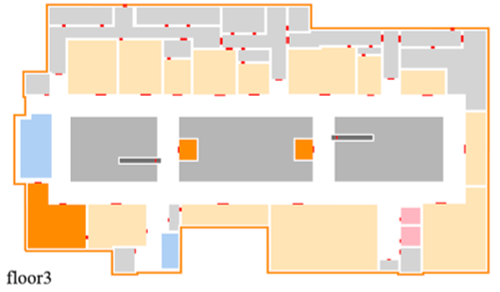

# Environment

## Definition

The *environment* is defined as the 3D layout where crowd simulation takes place, supporting sustainable navigation and interactive behaviors of individuals within it.

In this system, the environment is predefined as a 3-floor shopping mall. It is composed of structured 3D models and includes various types of shops, cafes, and associated details like items for sale, as well as facilities like escalators, elevators, doors, gates, etc. The environment supports multiple interactions between characters and objects, and contains navigable ground structures. This environment is built using Unreal Engine, and a portion of the content is shown below:

This environment originates from [Fab](https://www.fab.com/listings/b1628005-1f64-4833-a076-475ae954daec).

## Structure 

### Macro

From a macro perspective, the shopping mall consists of three floors, with access between floors via escalators, elevators, or stairs, and includes a total of 40 open stores.

All the stores, areas, and facilities within the environment are extracted, with each defined as an *entity*. The entities have the following categories:

`[store, restaurant, area, toilet, lift, escalator, floor, unavailable area, useless]`.

Each entity is an instance of one of the aforementioned categories. For each entity, the following annotations are provided:  
- `id`: Unique identifier.
- `name`: The actual name of the entity within the shopping mall.
- `category`: The category label.
- `description`: A textual description of the entity.
- `boundary`: The coordinates that define the entity's boundary.
- `doors`: Coordinates for entry or exit of the entity (if applicable).

From these annotations, the top-view semantic map of the environment is obtained:  

Among all the entities, those that can be accessed by characters on a semantic level are filtered out. These entities are assigned additional attributes and defined as *states*. All states and their transfer relationships form a structured representation of the environment. For a detailed definition and structure of *state*, please refer to [state](https://llmcrowd.readthedocs.io/en/latest/developing/method_components/state.html).

### Micro

From a micro perspective, internal modeling of each entity is included:

    

    

Characters in the environment can navigate around (via a navigation mesh), perform specific actions, and interact with objects and facilities, such as looking into a mirror, sitting on a sofa to rest, or using an elevator. These functionalities are specifically defined and implemented in the [Simulator](https://llmcrowd.readthedocs.io/en/latest/developing/simulator/index.html) part.
