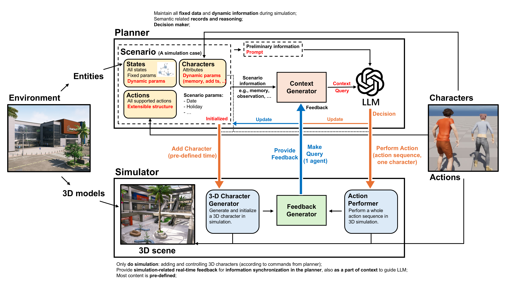

# Overview

Details to be added...

<!--
【the whole pipeline】
整个pipeline长什么样子，比如如何初始化，如何推进时间，如何query，如何做数据记录与输出，如何反馈循环与调整等等。
其中可能有些额外的element，比如character generator，随机打断器之类的。

在整个Pipeline中，分为Planner和Simulator两个模块。它们分别XXX

【Planner】
TBD

【Simulator】
TBD

【信息传递】
在整个Pipeline中，需要Planner端和Simulator端进行信息的传递。在这里，Planner就是嵌入了LLM的架构，而Simulator则为Unreal Engine。
- 通讯通过Socket完成，Planner作为Server，UE作为Client。
- 所有的消息传递的流程均为，Client提出请求+附加信息 -> Server返回请求结果 -> Cilent执行对应操作 -> Cilent返回实时执行结果反馈。
- 整个通讯过程分为两个阶段：
  1> 初始化阶段。 此阶段发生在UE的关卡运行之前，或者关卡刚刚运行的时候，用于初始化各种场景所需要的信息。Planner运行后始终监听UE的信号。UE连接Planner后，首先请求初始化。Planner准备好初始化所需要的所有信息(场景信息，所有角色信息)，将其经过处理后(处理成UE所需要的格式)打包发送给UE。UE根据信息对关卡进行对应的初始化设置，并返回反馈。
  2> 运行阶段。UE端会根据初始化信息，自动导入角色，并自动选择Query时机(当任何一个角色刚刚加入到关卡中时，以及角色刚刚执行结束一个动作时，暂停游戏并发出query)。任意时刻UE端发出Query后，Planner端都会接收Query并进行计算，将规划结果经过处理后打包发送回UE。UE根据收到的信息控制关卡内的角色行动。之后UE向Planner返回执行反馈。一直持续这个过程，直到游戏结束。

似乎我们并不需要UE_Python，只是使用蓝图就可以做到上述信息传递的功能。因为UE蓝图+Socket插件（TCP/UDP/WebSocket）就能实现client通信，角色的状态在蓝图里都能直接拿到，蓝图也能实现“暂停游戏/继续游戏/控制角色移动与动画”，且蓝图天然就是Tick/事件驱动，不用担心阻塞。蓝图拿到执行结果（比如动作是否完成、角色当前位置），直接通过socket回发即可。

所以现在我们可以尝试仅在蓝图中操作，脱离UE_Python。
Planner（外部 LLM 系统）：Server，外部Python程序，负责LLM+逻辑规划。
Simulator（UE）：Client，UE蓝图+Socket插件(Socket.IO Client)。
协议模式：
    UE(Client) -> 发请求+信息
    Planner(Server) -> 返回规划结果
    UE(Client) -> 执行动作并反馈执行结果
两个阶段
1. 初始化阶段(暂定为运行关卡后立马pause请求初始化)：UE请求 → Planner返回场景/角色信息 → UE初始化场景 → UE解除关卡pause
2. 运行阶段：UE根据触发时机（角色加入/动作完成）发Query → Planner计算并返回动作规划 → UE执行动作并反馈 → 循环直到结束
蓝图逻辑：
- GameMode：启动时暂停game，连接Planner，发初始化请求，完成初始化，游戏开始运行。
- 角色蓝图：在BeginPlay/动作完成时触发Query，接收Planner数据，执行Planner的规划，并向Planner返回执行feedback。
- 通讯Manager（一个蓝图Actor）：负责Socket收发，转发数据给角色/控制器。
在这里，通讯Manager相当于一个专门负责网络通讯的蓝图Actor/Component，本质上就是一个“Socket 控制中心”，负责维护socket连接之后的消息接收逻辑，以及提供消息发送接口。这个是自定义的一个actor，放在关卡中，关卡运行自动将其包含在内，只管数据收发,不管数据解析和理解。通常而言,由GameMode控制全局逻辑。关卡打开时,GameMode找到CommuManager，然后调用其中的ConnectEvent连接server，连接后CommuManage开始自动开始监听数据来没来。无论是GameMode还是Character,都有一个OnMessageReceive一直在监听Server的消息。为了维持通讯的顺序,Character会每次发送Query之前暂停游戏,然后调用CommManager中的发送函数发送消息,并设置一个PendingQueryID。然后OnMessageReceive接收到数据之后,先把CharacterID和当前Character的ID比一比确定没收错消息,然后和PendingQueryID比较,确认这就是当前Query要的数据,然后再执行相关操作。执行之后,将游戏打开。这个逻辑需要确定清楚,因为通讯的过程是异步的,每个Character都由CommManager进行数据接收。所以,为了准确控制,必须保证每次收发数据的只有一个Character才行。

在初始化的时候，我们要将所有actor的信息都告诉UE，包括每个actor什么时候添加进场景。然后在每次tick的时候，检查该次tick有没有需要添加进场景的actor。为了加快查询，在Planner端对所有actor按照添加时间从先到后排序，再传送给UE。这样UE每次tick都只需要检查还没添加的actor中index最小的即可。

整个pipeline中，通讯模块的逻辑：
因为UE和Python的通讯端是异步进行的，也就是UE发送query然后Py会立马返回一个Reply。UE端send是可以自己控制什么时候发送的，但是receive就只能通过一个on message received来接收UE端发送回来的广播。也就是，每个character，包括GameMode，都会接收到所有的信息，所以需要规划好逻辑。另外，在UE中利用到了暂停机制，也就是UE每次发送一个信息给Python的时候，Scenario都会被暂停住不动，接收到消息后，Scenario开始运行。但是这个暂停，只能暂停场景，不能暂停信息收发，所以需要二者配合完成正确的信息收发逻辑。
1. 首先明确一点，我一定会在发送信息之前暂停游戏进程。既然这样，那我每次发送的时候，一定是只有一个主体在和Python通讯。在初始化的时候，GameMode需要请求Python给自己发送初始化信息，Python发送之后，GameMode完成初始化，这个过程只有GameMode和Python通讯，因为Character还没有加入到场景中，只有初始化完成之后才会被加入。Character陆陆续续被加入到场景中之后，每个Character都会在任意时间向Python发送Query，发送query之前暂停游戏，这也能保证每次和Python交换信息的都是同一个Character，因为游戏被暂停了，时间不流动，游戏不运行就不会有其他character产生query。
2. 那问题主要就在于，我需要规范化每个主体和python通讯时的通讯过程。主体一共两类，character和GameMode。
   - GameMode是在初始化的时候通讯一次，之后就再也不参与通讯了。通讯的逻辑也就是简单的send，然后receive之后设置变量。之后就是一直tick添加character。由于只发一条消息，而且只有收到回复之后才会添加其他通讯主体，所以这个是安全的，不需要额外进行通讯逻辑梳理。
   - Character由于可能存在多次收发，所以需要梳理逻辑。
     > char被创建时。 发送add_char_feedback->接收回复->发送action_query->接收回复->发送action_start_feedback->接收回复->action start
     > char完成action时。 发送action_complete_feedback->接收回复->发送action_query->接收回复->发送action_start_feedback->接收回复->action start
     所以这个过程中，character需要完成发送和接收的逻辑顺序，python端什么都不用管，主要UE接收到回复再发送就可以。
     目前暂定逻辑：
        TBD: 首先设置一个变量WaitingForReply为False，PendingQueryQueue为待处理的query队列，PendingQueryID为目前发送的query的id。
        在character被创建的时候和完成action的时候，写一个队列，把所有的query存在队列里，并且判断WaitingForReply是否为False，如果是，那么调用ProcessNextQuery，开始处理Query。
        在ProcessNextQuery中，判断如果PendingQueryQueue不为空，则设置WaitingForReply为True，获得队列中的第一个query，为它生成QueryID，并设置为PendingQueryID， 将其发送给Python。
        在OnMessageReceive中，如果收到的reply匹配到了现在PendingQueryID，则执行相关指令，然后删掉队列的第一个元素，并设置WaitingForReply为False，然后再Call ProcessNextQuery。
        在开始存query到队列中之前，就pause game，并把action_to_perform设为空。query执行过程中，把收到的action存在action_to_perform中。在ProcessNextQuery中如果判断PendingQueryQueue是空的了且action_to_perform不为空，那就代表询问完了，就可以执行action。在char完成action时,先判断一下action_to_perform是不是离开场景，再清空它。如果是离开场景，直接把character销毁就行。如果不是，就清空并准备下一个query队列。

- 在目前的流程中，spawn character的query pipeline，在一开始的时候可以正常运行。但是，当spawn到第三个或者第四个左右的actor的时候，就会出现server发送回来的消息，UE接收不到的情况，导致UE一直等待。目前原因猜测：
  (1) 事件分发器存在上限或者bug，如果场景中存在的太多，就会出现问题。
  (2) SIOSocket出现断连，断连的时候如果Client正在等待Server的消息，Server发出来，Client是接收不到的，就会导致消息丢失。
  这个问题需要再好好debug一下，不然没法继续后续流程。要么想办法找到断连的原因并解决，要么写一个断连之后的消息恢复程序，要么就需要改通讯结构。
  目前观察到的现象和信息：
  (1) 我发现，每次运行server，确定好每个character的属性和添加时间后，多次反复运行UE端，每次UE都会卡在同一个位置，发送某个query后接收不到reply然后卡住。这说明这至少不是一个偶发现象，是某个固定的东西。
  (2) 在UE中，我尝试在GameMode每次tick打印SIOClient-IsConnected，它一直输出True，包括OnDisConnected也不触发回调，即便UE已经报了"SocketIO: SocketIO c3b4f1a1c5c74ff3adf435a79fc924d9 appears to have lost connection, reconnecting attempt 0 with delay 5000"这样的信息。
  (3) 我尝试在UE的GameMode每次tick都向Python发送Ping，并在Python端接收到时输出Ping Received。当UE的某个character无法接收到消息的时候，发现Python仍然可以收到Ping，说明连接还在，并没有断掉。
  (4) 我怀疑是character在spawn的时候，bind event之后就立马发送了query，导致reply到达的时候character还没有bind receive event完成导致的。在UE中测试，当character被spawn出来，执行bind event之后，set一个1秒的timer再发送query。结果发现问题并没有解决。
  (5) 我多次运行Python Server和UE Client，发现，每次卡住的character id都是不一样的，也就是，并不是spawn到一定数量的character就会出现问题。
  (6) 我对(3)进行了追加测试。我不仅在每次tick时向Python发送Ping，还让Python在接收到Ping之后返回一个消息确认自身收到了ping。观察到的现象是，在character卡住无法接收消息的那一刻起，所有Character和GameMode都无法通过CommManager的事件分发器OnMessageReceived接收到任何消息，但GameMode仍然可以成功向Python发送消息。也就是说，character无法接收到reply的时候，UE Client可以向Python Server发送消息，Python Server可以接收到，但Python Server返回给UE Client的消息无法被UE Client接收。
  (6) 另一个观察：所有无法接收reply的位置，都在game time 300s左右。我在game中设置了time dilation为10，因此real time大概是30s左右。我分别修改了time dilation为5和20进行测试，发现卡住的game time位置同步变为了150s和600s左右。这说明SIOClient出问题的时间是大概在现实时间的30s附近，而不依赖于game time。(后面又进行了测试，第一次刚打开UE比较卡，第11个character在220s左右卡住，同一次server运行，再次运行UE，变为了第15个character在300s卡住，再次验证了这是SIOClient基于现实时间挂掉的问题)
  (7) 进一步验证：不spawn character了，只在gamemode反复收发测试。破案了，是SIOSocket的问题。不spawn任何character，只在gamemode里面每次tick时发送消息到python然后接收回复，同样是在差不多的时间，连接出现问题，python可以收到消息，但是UE无法收到来自python的消息回复。

   接下来的debug路线：解决SIOSocket消息传输出现问题的bug。要么想办法调什么参数把这个问题解决了，要么添加一个检测和重连机制给它绕过去。

  解决！问题出在SIOServer的版本上。python-socketio的版本是4.x的时候，JavaScript Socket.IO version是1.x and 2.x。但是我所使用的UE-SocketIOClient所支持的JavaScript Socket.IO Server version是3.x and 4.x。所以应该把python-socketio的版本更新到5.x(对应JavaScript Socket.IO version 3.x and 4.x)才行。更新完之后就不会出现同样的问题了。

UE中Action Framework的设计：

BP_MCAction_Base (抽象层)
│
├── BP_MCAction_Simple           （子类：普通单动作）
│     ├── BP_MCAction_PrintOnScreen
│     ├── BP_MCAction_CallPhone
│     ├── BP_MCAction_PlayAnimation
│     ├── BP_MCAction_Delay
│
├── BP_MCAction_Composite        （组合动作）
│     ├── BP_MCAction_TimelineAction （多个子动作的时间线）
│
└── BP_MCAction_Parallel         （并行动作）

此架构中各部分的设计：

BP_MCAction_Base：
- 这是Action框架的基类，其他类都是从此类继承得来。
- 属性: 
    IsActionActive (bool)
    IsActionFinished (bool)
    UseDuration (bool)
    Duration (float)
    ElapsedTime (float)
    TargetCharacter (Character)
    OnActionFinished (EventDispatcher)
- 函数:
    FUNC ExecuteAction(Character):
        ClearTimer(FinishAction)
        SetComponentTickEnabled(true)  <-- 默认tick enable，不需要tick的将tick event留空
        Set IsActionActive = true
        Set IsActionFinished = false
        Set ElapsedTime = 0
        Set TargetCharacter = Character
        OnBeginAction()   <-- 给子类做初始化逻辑
        if UseDuration:
            StartTimer(Duration, FinishAction)

    FUNC FinishAction():
        ClearTimer(FinishAction)
        if IsActionFinished: return
        Set IsActionActive = false
        Set IsActionFinished = true
        OnActionCompleted()  <-- 给子类清理逻辑
        Broadcast(OnActionFinished)

    FUNC CancelAction():
        ClearTimer(FinishAction)
        if IsActionFinished: return
        Set IsActionActive = false
        Set IsActionFinished = true
        // *不调用 OnActionCompleted*
        Broadcast(OnActionFinished)

    Event OnBeginAction() 用于子类重写
    Event OnActionCompleted() 用于子类重写
    Event OnActionTick(DeltaTime) 用于子类重写 当子类需要Tick时用(Action组合和并行)
    
    Action::Tick(DeltaTime):
        if IsActionActive:
            CurrentAction.OnActionTick(DeltaTime)

    前面两个FUNC是不能动的固定逻辑，后面三个Event用于子类重写以实现不同的功能。

BP_MCAction_SimpleXXX：
- 这个可以直接继承BP_MCAction_Base来实现，包括Duration之后强制停止，或者执行结束后自己停止都可以。
- 如果是Duration之后强制停止， 就设置UseDuration=true，Duration=X。然后在OnBeginAction中执行Action，在OnActionCompleted中清除Action。
- 如果是Action执行完之后自动停止，就设置UseDuration=false，在OnBeginAction中执行Action，并绑定AnimNotify，完成时调用FinishAction。

BP_MCAction_TimelineAction （继承自BP_MCAction_Base）
- 属性:
    UseDuration = true   （整个Action的总时间）
    Duration = XXX
    TimelineSteps (Array of Struct): （这是一个数组，数组的每个元素都是一个已定义的BP_MCAction，以及其时间区间）
        - StartTime
        - EndTime
        - ActionClass
        - SpawnedActionInstance
- 函数：
    Event OnBeginAction：
        None
    Event OnActionTick(DeltaTime)：(重写)
        ElapsedTime += DeltaTime
        for each Step in TimelineSteps:
            if ElapsedTime >= Step.StartTime AND not Step.Started:
                 Step.ActionInstance = AddComponent(Step.ActionClass)
                 Step.ActionInstance.ExecuteAction(TargetCharacter)
                 Step.Started = true
            if ElapsedTime >= Step.EndTime AND not Step.Ended:
                 Step.ActionInstance.FinishAction()
                 Step.Ended = true
    每个TimeLine中的小Action会在时间到了的时候被调用FinishAction，包括它自己也会用Timer调用。整体的大Action区间会在时间到了后调用自己的FinishAction。
- 实例：如果想要设置一个嵌套Action，导航60s - 10–30s打电话 - 30–50s玩手机 - 40–43s同时咳嗽，有两种选择：
    (1) 自己手动嵌套，即设置一个BP_Action_NavigateWithActivities（继承TimelineAction）,然后配置Duration为60秒，TimelineSteps数组为
        [10 , 30] BP_Action_CallPhone
        [30 , 50] BP_Action_PlayMobile
        然后在BP_Action_PlayMobile内部，再继承TimelineAction，设置Duration=20，Timeline只有一个[10,13] BP_Action_Cough。
    (2) 可以直接把所有的action直接塞到同一个TimelineAction中，简单方便：
        TimelineSteps:
        [
            (0, 60, BP_Action_Navigate),
            (10, 30, BP_Action_CallPhone),
            (30, 50, BP_Action_PlayMobile),
            (40, 43, BP_Action_Cough)
        ]
- 后续实现时，可以把所有的action分别实现在各个BP_MCAction中，然后使用一个BP_MCAction_TimelineAction的实例，按需求直接自动化组合。即，实例化一个TimelineAction，然后按照各个action的时间区间信息设置好TimelineSteps即可，然后就可以自动化按时间执行各个Action了。
- (直接创建一个BP_MCAction_Timeline实例 → 填入TimelineSteps → ExecuteAction，就能完成所有组合动作)

BP_MCAction_Parallel：
- 可以继承自ActionBase，在OnBeginAction启动多个子Action，不需要Tick。
- 子Action都执行完成后再FinishAction（或无论子Action状态，主Action自己结束）。

当Planner设置好action之后，要发送给UE的有两个，一个是action_args用于保存当前action的实例化参数，另一个是由Planner端帮忙解构好的action_to_perform，让UE能更快更方便的执行action。这两部分都由UE接收并存储，action_to_perform就存在对应变量里，后续拿来执行，然后action_args存在一个新变量CurrentActionArgs中用于后续信息传递。

√ Step 1：将Pipeline中的Scenario搭建起来，让我们可以实例化一个Scenario。
√ Step 2：新建一个main_pipeline_server.py，用以实现仿真一整天的shopping mall的pipeline中Server端的全部内容。
          新建一个data_conversion.py，用于定义双方数据交换通讯协议，以及数据格式转换函数。
√ Step 3：完成pipeline中初始化阶段的所有逻辑，包括：
        在main_pipeline_server.py,planner_to_ue.py,和ue_to_planner.py中实现场景初始化，数据发送，和数据接收逻辑。
        在UE端添加连接server的逻辑，数据接收逻辑，以及simulator初始化逻辑等。
        两边一起实现，最终效果是，可以按照planner的初始化结果，在simulator中完成对应的初始化全程，且后续按照初始化内容添加行人。
        这一部分可以慢慢来，先测通讯，再慢慢丰富通讯的数据内容。
Step 4：完成pipeline中运行阶段的所有逻辑。
        内容很多，较为复杂，略。
Step 5：整体联调，修复漏洞，解决问题。

->>